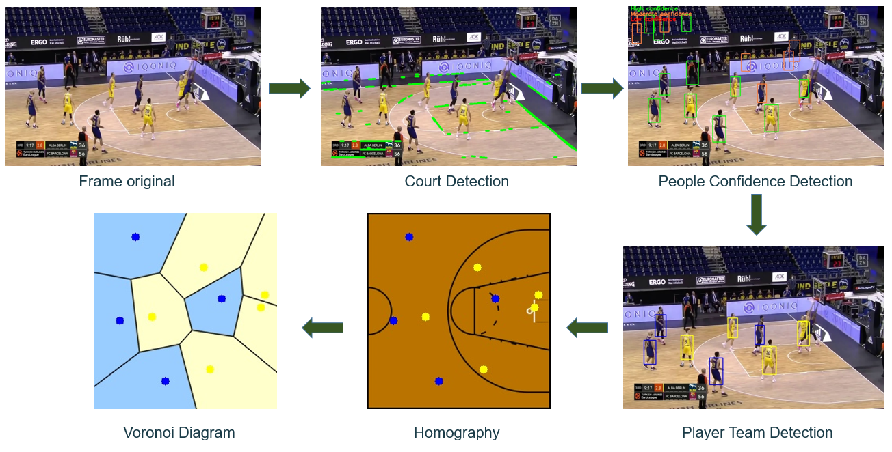

# Welcome to basketCV :wave: !!

Automatic application of detection and tracking of basketball players during a game from an analysis of the MP4 video using artificial vision techniques.

:point_right: From an MP4 video the tool will:

:one: Basketball court detection

:two: People detection

:three: Player team detection

:four: Player tracking and applications: homography 2D and voronoi diagram

## Demo

